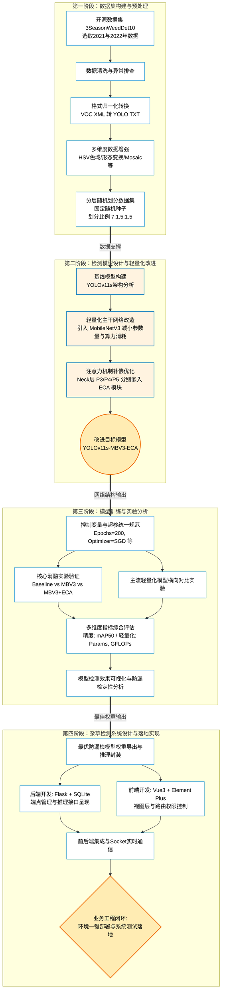

# 研究内容与技术路线图

```mermaid
graph TD
    classDef phase fill:#e1f5fe,stroke:#31708f,stroke-width:2px,color:#000
    classDef step fill:#ffffff,stroke:#0288d1,stroke-width:1px,color:#000
    classDef model fill:#fff3e0,stroke:#0277bd,stroke-width:1.5px,color:#000
    classDef highlight fill:#ffecb3,stroke:#ef6c00,stroke-width:2px,color:#000

    %% Phase 1: 数据准备
    subgraph Phase1 [第一阶段：数据集构建与预处理]
        direction TB
        A1[开源数据集 3SeasonWeedDet10<br/>选取2021与2022年数据]:::step --> A2[数据清洗与异常排查]:::step
        A2 --> A3[格式归一化转换<br/>VOC XML 转 YOLO TXT]:::step
        A3 --> A4[多维度数据增强<br/>HSV色域/形态变换/Mosaic等]:::step
        A4 --> A5[分层随机划分数据集<br/>固定随机种子<br/>划分比例 7:1.5:1.5]:::step
    end

    %% Phase 2: 模型设计
    subgraph Phase2 [第二阶段：检测模型设计与轻量化改进]
        direction TB
        B1[基线模型构建<br/>YOLOv11s架构分析]:::model --> B2[轻量化主干网络改造<br/>引入 MobileNetV3 减小参数量与算力消耗]:::model
        B2 --> B3[注意力机制补偿优化<br/>Neck层 P3/P4/P5 分别嵌入 ECA 模块]:::model
        B3 --> B4((改进目标模型<br/>YOLOv11s-MBV3-ECA)):::highlight
    end

    %% Phase 3: 实验评估
    subgraph Phase3 [第三阶段：模型训练与实验分析]
        direction TB
        C1[控制变量与超参统一规范<br/>Epochs=200, Optimizer=SGD 等]:::step --> C2[核心消融实验验证<br/>Baseline vs MBV3 vs MBV3+ECA]:::step
        C1 --> C3[主流轻量化模型横向对比实验]:::step
        C2 --> C4[多维度指标综合评估<br/>精度: mAP50 / 轻量化: Params, GFLOPs]:::step
        C3 --> C4
        C4 --> C5[模型检测效果可视化与防漏检定性分析]:::step
    end

    %% Phase 4: 系统开发
    subgraph Phase4 [第四阶段：杂草检测系统设计与落地实现]
        direction TB
        D1[最优防漏检模型权重导出与推理封装]:::step --> D2[后端开发: Flask + SQLite<br/>端点管理与推理接口呈现]:::step
        D1 --> D3[前端开发: Vue3 + Element Plus<br/>视图层与路由权限控制]:::step
        D2 --> D4[前后端集成与Socket实时通信]:::step
        D3 --> D4
        D4 --> D5{业务工程闭环:<br/>环境一键部署与系统测试落地}:::highlight
    end

    %% 流程连接逻辑
    A5 ==>|数据支撑| B1
    B4 ==>|网络结构输出| C1
    C5 ==>|最佳权重输出| D1
```
