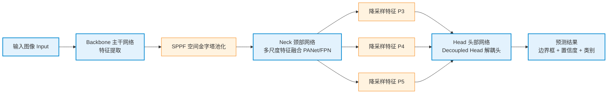

# 图2-x YOLOv11算法网络结构图

```mermaid
graph LR
    classDef main fill:#e3f2fd,stroke:#0288d1,stroke-width:2px
    classDef sub fill:#fff3e0,stroke:#f57c00,stroke-width:1px
    
    Input[输入图像 Input]:::main --> Backbone[Backbone 主干网络<br/>特征提取]:::main
    Backbone --> SPPF[SPPF 空间金字塔池化]:::sub
    SPPF --> Neck[Neck 颈部网络<br/>多尺度特征融合 PANet/FPN]:::main
    Neck --> P3[降采样特征 P3]:::sub
    Neck --> P4[降采样特征 P4]:::sub
    Neck --> P5[降采样特征 P5]:::sub
    
    P3 --> Head[Head 头部网络<br/>Decoupled Head 解耦头]:::main
    P4 --> Head
    P5 --> Head
    
    Head --> Output[预测结果<br/>边界框 + 置信度 + 类别]:::main
```
