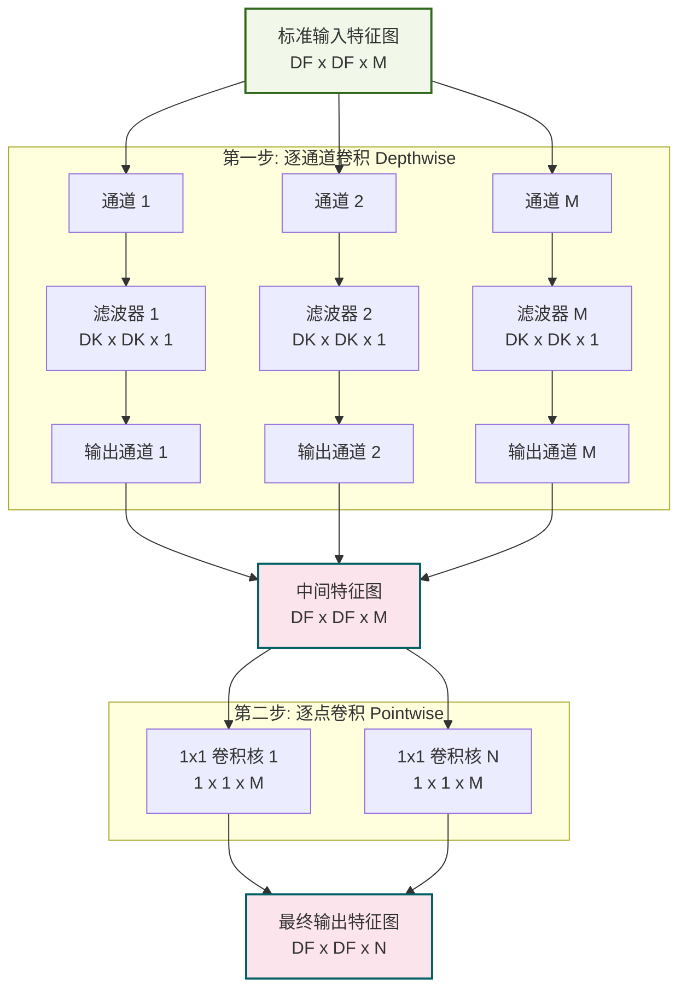

# 图2-x 深度可分离卷积原理图

```mermaid
graph TD
    classDef input fill:#f1f8e9,stroke:#33691e,stroke-width:2px
    classDef process fill:#e0f7fa,stroke:#01579b,stroke-width:1.5px
    classDef output fill:#fce4ec,stroke:#006064,stroke-width:2px

    Input[标准输入特征图<br/>DF x DF x M]:::input
    
    subgraph Depthwise_Conv[第一步: 逐通道卷积 Depthwise]
        direction LR
        A1[通道 1] --> F1[滤波器 1<br/>DK x DK x 1] --> O1[输出通道 1]
        A2[通道 2] --> F2[滤波器 2<br/>DK x DK x 1] --> O2[输出通道 2]
        A3[通道 M] --> F3[滤波器 M<br/>DK x DK x 1] --> O3[输出通道 M]
    end
    
    Input --> A1
    Input --> A2
    Input --> A3
    
    Mid[中间特征图<br/>DF x DF x M]:::output
    O1 --> Mid
    O2 --> Mid
    O3 --> Mid
    
    subgraph Pointwise_Conv[第二步: 逐点卷积 Pointwise]
        direction LR
        P1[1x1 卷积核 1<br/>1 x 1 x M]
        P2[1x1 卷积核 N<br/>1 x 1 x M]
    end
    
    Mid --> P1
    Mid --> P2
    
    Out[最终输出特征图<br/>DF x DF x N]:::output
    P1 --> Out
    P2 --> Out
```
