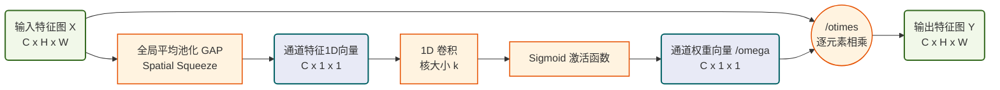

# 图2-x ECA注意力机制模块结构图

```mermaid
graph LR
    classDef input fill:#f1f8e9,stroke:#33691e,stroke-width:2px
    classDef process fill:#fff3e0,stroke:#e65100,stroke-width:1.5px
    classDef output fill:#e8eaf6,stroke:#006064,stroke-width:2px

    Input(输入特征图 X<br/>C x H x W):::input --> GAP[全局平均池化 GAP<br/>Spatial Squeeze]:::process
    GAP --> FC(通道特征1D向量<br/>C x 1 x 1):::output
    
    FC --> Conv1D[1D 卷积<br/>核大小 k]:::process
    Conv1D --> Sigmoid[Sigmoid 激活函数]:::process
    
    Sigmoid --> Weight(通道权重向量 /omega<br/>C x 1 x 1):::output
    
    Input --> Multiply(( /otimes <br/>逐元素相乘 )):::process
    Weight --> Multiply
    
    Multiply --> Output(输出特征图 Y<br/>C x H x W):::input
```
